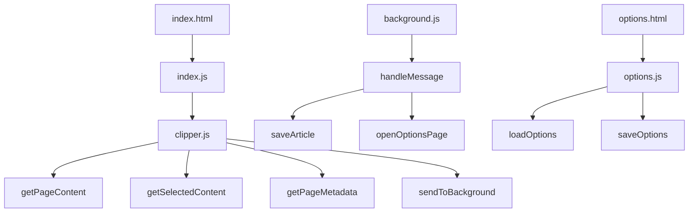

## SpecStory

## Untitled (2025/2/28 10:55:52)

_**User**_

---

_**Assistant**_

```mermaid
graph TD
    A[index.html] --> B[index.js]
    B --> C[clipper.js]
    C --> D[getPageContent]
    C --> E[getSelectedContent]
    C --> F[getPageMetadata]
    C --> G[sendToBackground]
    
    H[background.js] --> I[handleMessage]
    I --> J[saveArticle]
    I --> K[openOptionsPage]
    
    L[options.html] --> M[options.js]
    M --> N[loadOptions]
    M --> O[saveOptions]
```

---

---

